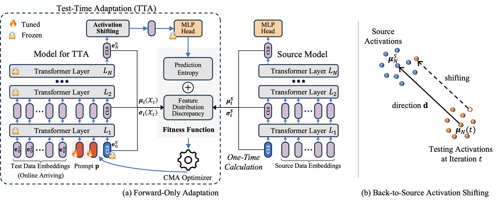

# Test-Time Model Adaptation with Only Forward Passes

This is the official project repository for Test-Time Model Adaptation with Only Forward Passes by Shuaicheng Niu, Chunyan Miao, Guohao Chen, Pengcheng Wu, Peilin Zhao (ICML 2024)

* 1️⃣ FOA conducts model learning at test time to adapt a pre-trained model to test data that has distributional shifts ☀️ 🌧 ❄️, such as corruptions, simulation-to-real discrepancies, and other differences between training and testing data.
* 2️⃣ FOA performs adaptation on both _input_ and _output_ levels, which avoids modification to model parameters and adapts in a backpropagation-free manner. Consequently, FOA offers the following benefits:
  1) reduces memory usage significantly, _e.g._, 5,165MB (Tent) $\rightarrow$ 832MB when using ViTBase and a _BS_ of 64. 
  2) compatible with quantized models, which typically do not support backpropagation.
  3) compatible with models on specialized chips, where parameters are hardcoded and non-modifiable. 

<p align="center">

</p>


**Dependencies Installation:**
```
pip install cma
pip install torch==2.1.0 torchvision==0.16.0 torchaudio==2.1.0 --index-url https://download.pytorch.org/whl/cu118
pip install timm==0.9.10
```

**Data Preparation:**

This repository contains code for evaluation on ImageNet-C/R/V2/Sketch with VitBase. But feel free to use your own data and models! Please check [here 🔗](dataset/README.md) for a detailed guide on preparing these datasets.

**Usage**
```python
from tta_library.foa import FOA
from models.vpt import PromptViT

model = TODO_model()
model = PromptViT(model, 3)

adapt_model = FOA(model, args.fitness_lambda)
train_loader = TODO_loader()
adapt_model.obtain_origin_stat(train_loader)

outputs = adapt_model(inputs)
```

# Example: ImageNet-C Experiments

**Usage (full precision experiments):**
```
python3 main.py \
    --data path/to/imagenet \
    --data_v2 path/to/imagenet-v2 \
    --data_sketch path/to/imagenet-sketch \
    --data_corruption path/to/imagenet-c \
    --data_rendition path/to/imagenet-r \
    --algorithm [tent/foa/lame/t3a/sar/cotta] \ 
```
For experiments with quantized ViT, simply add 
```
--quant
```
 in the above command.

**Experimental Results**

The Table below demonstrates the result of both full precision and quantized ViTs. The reported average accuracy (\%, $\uparrow$) / ECE (\%, $\downarrow$) is averaged over 15 different corruption types in ImageNet-C (severity level 5).

|         | ViT (full precision, 32-bit) | ViT (8-bit) | ViT (6-bit) |
| ------- | :----------: | :---------: | :---------: |
| NoAdapt | 55.5 / 10.5  | 54.1 / 10.8 | 47.7 / 9.9  |
| LAME    | 54.1 / 11.0  | 52.5 / 12.4 | 45.8 / 10.4 |
| T3A     | 56.9 / 26.8  | 55.1 / 25.9 | 45.4 / 30.1 |
| Tent    | 59.6 / 18.5  |      -      |      -      |
| CoTTA   |  61.7 / 6.5  |      -      |      -      |
| SAR     |  62.7 / 7.0  |      -      |      -      |
| FOA     |  66.3 / 3.2  | 63.5 / 3.8  | 55.8 / 5.5  |

Please see our [PAPER 🔗]() for more detailed results.

# Correspondence

Please contact Shuaicheng Niu by [shuaicheng.niu at ntu.edu.sg] and Guohao Chen by [chenguohao987 at gmail.com] if you have any questions. 📬

# Citation

If our FOA method or the setting of test-time adaptation with only forward passes is helpful in your research, please consider citing our paper:

```
@inproceedings{niu2024test,
  title={Test-Time Model Adaptation with Only Forward Passes},
  author={Shuaicheng Niu, Chunyan Miao, Guohao Chen, Pengcheng Wu, Peilin Zhao},
  booktitle = {The International Conference on Machine Learning},
  year = {2024}
}
```

# Acknowledgment

The code is inspired by [EATA 🔗](https://github.com/mr-eggplant/EATA) and [VPT 🔗](https://github.com/KMnP/vpt)